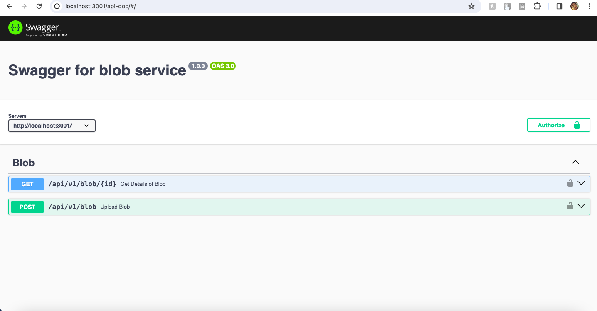
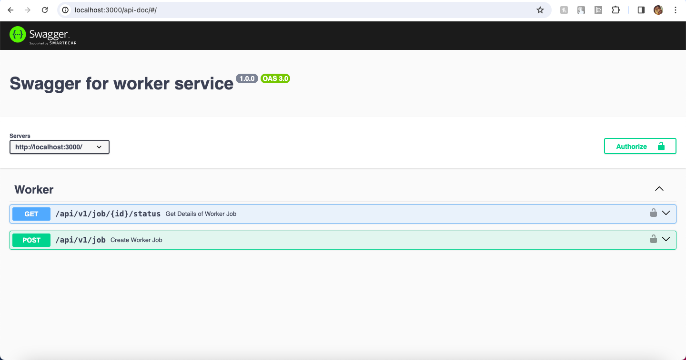

# Design Patter for blob worker application
- For Backend Development Module Design Pattern is used for managing application functionality
- Backend Comunicate with third party apis using https / http protocol (https://worker.cloud.net, https://worker.blob.net/)
- API's are authenticated with authorization token for authentication

### Swagger Implementation (Blob Service : http://localhost:3001/api-doc/, Worker Service : http://localhost:3001/api-doc/)
## Local Build and Setup


```bash
docker compose up
```

## For deployment to a Kubernates production environment.
We can write a deployment file for kubernates with a Service and loadbalancer while exposing the deticated application port, and writing a deployment app for the container image build with docker compose and assiging the replica set for the app to run on production

### Screen Shoots



